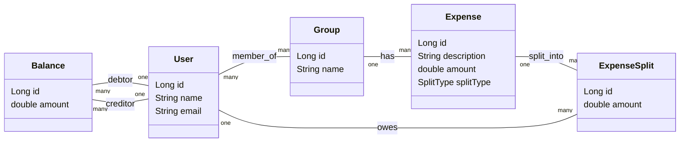

# Expense Sharing Application (Backend)

A simplified backend implementation of an **expense sharing application** (similar to Splitwise) built using **Spring Boot**.
This project focuses on **clean design, correct business logic, and balance simplification**.

---

## Features

* Create users
* Create groups and manage group members
* Add shared expenses
* Supported split types:

  * Equal split
  * Exact amount split
  * Percentage split
* Track balances (who owes whom)
* Simplified net balances

---

## Tech Stack

* Java 17
* Spring Boot
* Spring Web
* Spring Data JPA
* H2 In-Memory Database
* Lombok

---

## High-Level Architecture

The application follows a **layered architecture**:

* **Controller Layer** – Handles REST APIs
* **Service Layer** – Contains business logic
* **Repository Layer** – Database access using JPA
* **Model Layer** – Domain entities

---

## System Design (Mermaid Diagram)



---

## Core Domain Model

* **User**
  Represents an individual using the application.

* **Group**
  Represents a collection of users sharing expenses.

* **Expense**
  Represents a transaction paid by one user for a group.

* **ExpenseSplit**
  Stores how much each user owes for a specific expense.

* **Balance**
  Stores net dues between users in simplified form.

---

## Split Strategies

### Equal Split

The total expense amount is divided equally among selected users.

### Exact Split

Each user pays an exact amount specified in the request.

### Percentage Split

Each user pays a percentage of the total expense.

---

## Balance Simplification

Balances are stored in **net form** to avoid redundant entries.

Example:

* A owes B ₹500
* B owes A ₹200

Final balance:

* A owes B ₹300

Only one directional entry is stored.

---

## API Overview

### User APIs

* `POST /users` – Create user

### Group APIs

* `POST /groups` – Create group
* `POST /groups/{groupId}/users` – Add users to group

### Expense APIs

* `POST /expenses` – Add an expense

### Balance APIs

* `GET /balances` – View all balances

---

## Sample Expense Request

```json
{
  "groupId": 1,
  "paidBy": 1,
  "amount": 600,
  "description": "Hotel",
  "splitType": "EQUAL",
  "splits": {
    "2": 0,
    "3": 0
  }
}
```

---

## Running the Application

1. Clone the repository
2. Run the Spring Boot application
3. Test APIs using Postman
4. H2 Console is available at `/h2-console`

---

## Notes

* Uses H2 in-memory database for simplicity
* Designed for clarity and easy extension
* Can be enhanced with authentication, settlement APIs, and persistent databases

---